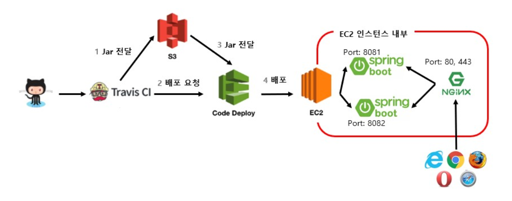

### 아래 도서에 대한 실습

[스프링 부트와 AWS로 혼자 구현하는 웹 서비스
*인텔리제이, JPA, JUnit 테스트, 그레이들, 소셜 로그인, AWS 인프라로 무중단 배포까지*](http://www.kyobobook.co.kr/product/detailViewKor.laf?ejkGb=KOR&mallGb=KOR&barcode=9788965402602&orderClick=LEa&Kc=#N)

  

#### 개요

1. 간단한 CRUD를 구현한 웹애플리케이션 제작 : `SpringBoot`, `WS RDS`
2. CI&CD : `Travis CI`, `AWS EC2`, `AWS S3`, `AWS CodeDeploy`
3. 무중단 배포 : `Nginx`

